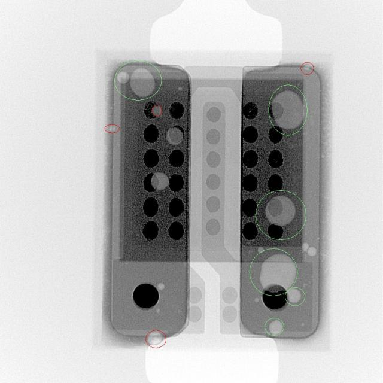

# SAM (Segment Anything Model)-Quality_Control

[](https://github.com/Tchouanga12/SAM-Quality_Control/blob/main/LICENSE)
[](https://www.python.org/downloads/)
[](https://github.com/Tchouanga12/SAM-Quality_Control/graphs/contributors)

**SAM Quality Control** is a Python-based project designed to automate and enhance quality control processes for manufacturing or service environments. The tool provides a robust framework for monitoring, analyzing, and reporting on quality metrics, ensuring that standards are consistently met.

## 🌐 Live Demo

You can visit the live version of the web application here: ([SAM APP](https://samappdocker.onrender.com)) - **In maintenance**

## Features

- **Automated Data Collection**: Seamlessly collect and process quality-related data from various sources.
- **Statistical Process Control (SPC)**: Implement SPC charts to monitor production quality in real time.
- **Defect Tracking**: Track and analyze defects to identify root causes and implement corrective actions.
- **Customizable Reports**: Generate detailed reports tailored to specific quality control needs.
- **Integration with Existing Systems**: Easily integrate with existing ERP and MES systems to streamline quality control workflows.
  
## Main Use Case
Solving the problem of void detection on electronic components using SAM (Segment Anything Model). Given an input image or a batch of input images, our app can:

- **Detect electronic components and voids** 
- **Segment electronic components and voids**
- **Print a segmentation report with several metrics** such as the component area and the percentage of area occupied by void.

Nb: A void is a small, empty spaces or gaps that can form within materials used in the construction of electronic component.

## Project Structure

Here's an overview of the project structure and its components:

### **data**

- **Data_Transformation**: Contains the processed data required for model training and evaluation.
  - `train/`: Training dataset.
  - `test/`: Testing dataset.
  - `validation/`: Validation dataset.
  - `data.yaml`: Configuration file for the data.

- **PCB_xray_dataset**: Contains raw image data for analysis.

### **model**

- **YOLO Detection Model**: Pre-trained YOLO models for object detection.
- **SAM Segmentation Model**: Pre-trained SAM models for image segmentation.

### **templates**

- **base.html**: The base HTML template with placeholders for dynamic content.
- **index.html**: The main entry point for the web application, extending `base.html`.

### **scripts**

- **app.py**: Defines the route functions for the web application.
- **detection.py**: Contains the script for performing YOLO object detection.
- **segmentation.py**: Contains the script for performing SAM image segmentation.
- **report.py**: Generates reports based on the detection and segmentation results.
- **all.py**: A script that executes all three operations (detection, segmentation, and report generation) sequentially.


## Getting Started Locally

1. **Setup**: Ensure you have all dependencies installed. You can install them using `pip`:

   ```bash
   pip install -r requirements.txt
